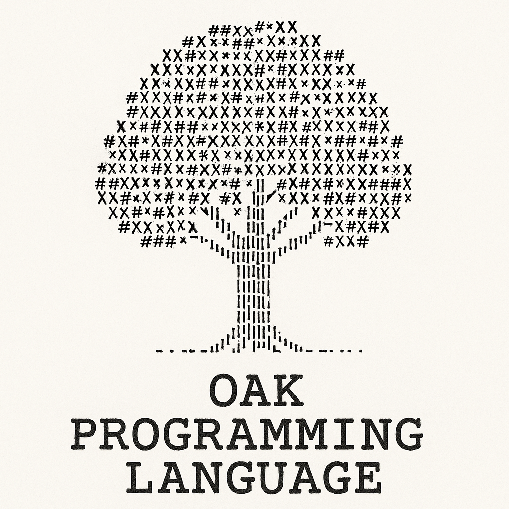

# The Oak Programming Language

A Rust-implemented compiler for a statically-typed, systems programming language with mathematical focus and LLVM code generation.

## Features

✨ **MVP Features:**

- ✅ **Complete Compiler Pipeline:** Lexer → Parser → Semantic Analysis → LLVM IR
- ✅ **Primitive Types:** i8-i64, u8-u64, posint8-64, f32, f64, bool, str, Text, void
- ✅ **Advanced Type System:** Type inference, type casting with `as`, pointers, references, arrays
- ✅ **Static Type Checking:** Compile-time type verification and error reporting
- ✅ **Functions:** First-class functions with parameters and return types
- ✅ **Structs:** User-defined composite types
- ✅ **Arrays:** Fixed-size arrays with compile-time bounds checking
- ✅ **Memory Safety:** Pointers, references, and extern C support
- ✅ **LLVM Code Generation:** Cross-platform compilation to native code
- ✅ **FFI (Foreign Function Interface):** Call C functions directly
- ✅ **REPL Mode:** Interactive command-line interpreter
- ✅ **Single-line Comments:** `#` comment syntax

## Quick Start

### Installation

Requires Rust 1.70+ and LLVM 18

```bash
# Clone and build
git clone https://github.com/admodev/oak.git
cd oak
cargo build --release

# Run an example
./target/release/oak examples/hello_world.oak

# Start REPL
./target/release/oak -r
```

### Example Programs

#### Hello World

```oak
extern fn printf(i8*, ...) -> i32;

fn main() -> void {
    printf("Hello, Oak!\n");
}
```

#### Mathematical Functions

```oak
fn factorial(n: posint64) -> posint64 {
    if n <= 1 {
        ret 1;
    } else {
        ret n * factorial(n - 1);
    }
}

fn main() -> void {
    let result: posint64 := factorial(5);  # 120
}
```

#### Arrays and Pointers

```oak
fn sum_array(arr: [i32; 10]) -> i32 {
    let sum: i32 := 0;
    let i: i32 := 0;
    while i < 10 {
        sum := sum + arr[i];
        i := i + 1;
    }
    ret sum;
}
```

#### Extern C Integration

```oak
extern fn strlen(i8*) -> u64;
extern fn malloc(u64) -> *void;
extern fn free(*void) -> void;

fn main() -> void {
    let buffer: *void := malloc(256);
    free(buffer);
}
```

## Type System

### Primitive Types

| Category         | Types                                     |
| ---------------- | ----------------------------------------- |
| Unsigned Int     | u8, u16, u32, u64                         |
| Signed Int       | i8, i16, i32, i64                         |
| **Positive Int** | **posint8, posint16, posint32, posint64** |
| Float            | f32, f64                                  |
| Boolean          | bool                                      |
| String           | str, Text                                 |
| Special          | void                                      |

### Type Features

- **Type Inference:** Automatic type deduction
- **Type Casting:** `value as TargetType`
- **Pointers:** `*Type`, `&variable`
- **References:** `&Type`
- **Arrays:** `[Type; Size]`
- **Type Checking:** Compile-time verification

## Syntax Highlights

### Variables

```oak
let x: i32 := 42;           # Explicit type
let y := 3.14;              # Type inference
let mut z: i32 := 10;       # Mutable
let arr: [i32; 5] := [1, 2, 3, 4, 5];  # Array
```

### Functions

```oak
fn add(a: i32, b: i32) -> i32 {
    ret a + b;
}

fn no_return() -> void {
    # No return value
}
```

### Structs

```oak
struct Point {
    x: f64,
    y: f64,
}

let p: Point := { x: 1.0, y: 2.0 };
```

### Control Flow

```oak
if x > 0 {
    # Positive
} else if x < 0 {
    # Negative
} else {
    # Zero
}

while condition {
    # Loop
}

for i in [1, 2, 3] {
    # Iterate
}
```

### Comments

```oak
# This is a comment
let x := 42;  # Line comment
```

## Architecture

```
Source Code
    ↓
Tokenizer (Lexer)
    ↓
Parser (AST)
    ↓
Semantic Analyzer
    ↓
LLVM Code Generator
    ↓
LLVM IR
    ↓
LLVM Backend
    ↓
Machine Code
```

## Project Structure

```
oak/
├── src/
│   ├── lib.rs              # Library root
│   ├── bin/oak.rs          # CLI entry point
│   ├── tokenizer/mod.rs    # Lexer
│   ├── parser/mod.rs       # Parser & AST
│   ├── types.rs            # Type system
│   ├── semantic.rs         # Semantic analysis
│   ├── codegen.rs          # LLVM code gen
│   ├── errors.rs           # Error types
│   ├── repl/mod.rs         # REPL
│   ├── runtime/mod.rs      # Runtime
│   └── ...
├── examples/               # Example programs
├── docs/                   # Documentation
└── Cargo.toml             # Project manifest
```

## Documentation

- **[MVP Reference](./docs/MVP_REFERENCE.md)** - Complete feature documentation
- **[Build Guide](./docs/BUILD_GUIDE.md)** - Building and deployment
- **[Language Reference](./docs/LANGUAGE_REFERENCE.md)** - Language syntax and grammar
- **[Examples](./examples/)** - Example programs

## Development

### Building

```bash
# Debug build
cargo build

# Release build
cargo build --release

# Check compilation
cargo check
```

### Testing

```bash
# Run tests
cargo test

# Run specific test
cargo test parser

# Run with output
cargo test -- --nocapture
```

### Running Examples

```bash
# List examples
ls examples/

# Run example
oak examples/math_operations.oak

# Run all examples
for file in examples/*.oak; do
    echo "Testing $file"
    oak "$file"
done
```

## Command Line Usage

```bash
# Run script
oak program.oak

# Interactive mode (REPL)
oak -r

# Show help
oak -h

# Debug mode
oak -d program.oak
```

## Compilation Targets

Oak generates:

1. **LLVM IR** - Intermediate representation
2. **Object Files** - Linkable objects (.o)
3. **Executables** - Platform-native binaries

### Cross-Platform Support

- ✅ Linux (x86_64)
- ✅ macOS (x86_64, ARM64)
- ✅ Windows (x86_64)

## FFI Example

```oak
# Declare external C functions
extern fn puts(i8*) -> i32;
extern fn strlen(i8*) -> u64;

# Use them in Oak
fn print_length(str: i8*) -> void {
    let len: u64 := strlen(str);
    puts("String length computed");
}
```

## Performance

Typical compile times on modern hardware:

- Small program: <100ms
- Medium program: <500ms
- Large program: <2s

Generated code runs at near-native C speed after LLVM optimization.

## Roadmap

### Phase 2 (Post-MVP)

- [ ] Generics and trait system
- [ ] Pattern matching
- [ ] Module system
- [ ] Standard library
- [ ] Error handling (Result/Option)
- [ ] Lifetimes and borrowing
- [ ] Async/await

### Phase 3 (Production)

- [ ] Package manager
- [ ] Full standard library
- [ ] Debugging symbols
- [ ] Profile-guided optimization
- [ ] IDE support (VSCode, Vim)

## Contributing

Contributions welcome! Please:

1. Fork the repository
2. Create a feature branch
3. Make improvements
4. Submit a pull request

## License

MIT License - See LICENSE file

## Authors

- **Adolfo Moyano** - Creator and Lead Developer
- **Contributors** - See CONTRIBUTORS file

## Acknowledgments

- Built with Rust and LLVM
- Inspired by Rust, C, and functional programming languages
- Thanks to the Rust and LLVM communities

## Quick Links

- [GitHub Repository](https://github.com/admodev/oak)
- [Issue Tracker](https://github.com/admodev/oak/issues)
- [Documentation](./docs/)
- [Examples](./examples/)

---

**Current Version:** 0.1.0 (MVP)  
**Created:** 2025-11-13  
**Status:** ✅ Functional MVP - Ready for testing
